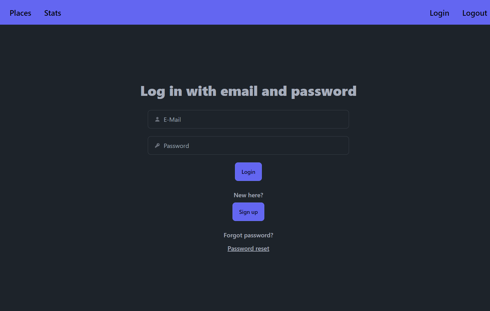
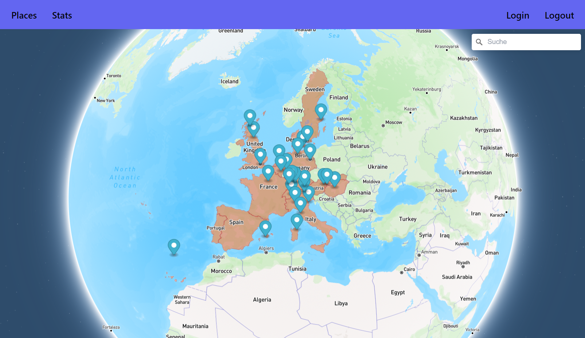
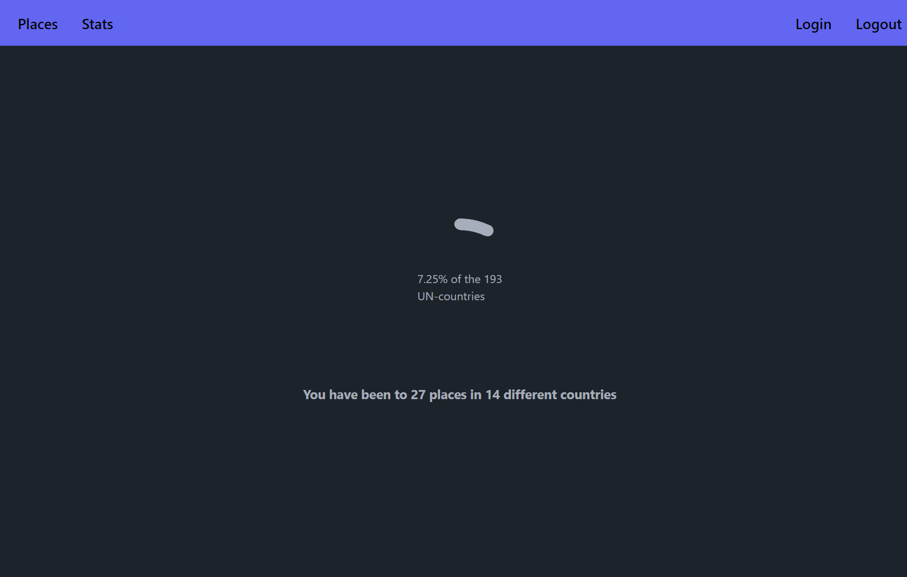

# Places - Dokumentation
Die Web-App "Places" ermöglicht es zu visualisieren welche Länder und Orte man bereits besucht hat.
# Funktionalitäten
Die Web-App hat oben auf jeder Seite eine Navigationsleiste. Auf der rechten Seite befinden sich dort ein *Login* und ein *Logout* Button. Links ist mit *Places* ein Button, der auf die *Home Page* (oder auch Standard-Seite der App) verlinkt. Daneben findet sich der Button *Stats*. Dieser führt zu einer Seite mit Statistiken. 

Beim Aufruf der App sieht der Nutzer eine Seite, die die App kurz beschreibt. Außerdem befindet sich dort ein weiterer *Login* Button. 

Klickt man auf diesen, wird man auf die *Login* Seite weitergeleitet. Diese erreicht man auch über den Button in der Navigationsleiste. Auf der Login Seite befindet sich ein Formular zu Eingabe der E-Mail - Adresse und des Passworts. Über einen Button kann man die Eingabe bestätigen und wird eingeloggt. Es erfolgt eine Weiterleitung auf die *Home Page* der App.



Sollte man noch keinen Account haben gibt es darunter einen Button *Sign up*. Dieser führt auf eine Seite, auf der man seine E-Mail - Adresse und ein Passwort eingeben kann um sich zu registrieren. Ist der Vorgang erfolgreich, wird man ebenfalls automatisch eingeloggt. 

Hat man sein Passwort vergessen, kann man auf der Login Seite einen Link klicken, der zum *Password Reset* führt. Auf dieser Seite kann man in einem Formular eine E-Mail - Adresse eingeben. Bestätigt man die Eingabe über einen Button, erhält man eine E-Mail. Diese beinhaltet einen Link, der zu einer Seite führt, auf der man sein neues Passwort eingeben an.

Die Home Page wird vollständig von einer Weltkarte in Globusform eingenommen. In der rechten oberen Ecke befindet sich eine Suchleiste. Dort kann man Orte und Länder suchen. Bereits während de Eingabe erhält man Vorschläge. Bestätigt man die Sucheingabe, zoomt die Karte zu dem entsprechenden Ort. Außerdem wird an dem Ort ein Marker auf der Karte gesetzt. Klickt man auf den Marker öffnet sich ein Popup. In diesem steht als Überschrift der Name des Ortes. Darunter folgen die passenden Koordinaten und ein *Löschen* Button. Dieser entfernt den gerade hinzugefügten Punkt. So lassen sich Ort und Länder die man bereits besucht hat eintragen.

Zusätzlich zu dem gesetzten Marker wird das Land, in dem der Ort liegt, hellrot markiert. 
Beim Löschen wird das Land auch wieder entfernt, wenn kein anderer Punkt in diesem Land mehr gespeichert ist. 



Des Weiteren gibt es eine Statistik Seite. Auf dieser befindet sich ein Kreisdiagramm, das anzeigt wie viel Prozent der 193 Länder, die offiziell von der UN anerkannt sind, bereits besucht wurden. Außerdem steht darunter ein Text, der anzeigt wie viele verschiedene Orte man in wie vielen verschiedenen Ländern man besucht hat.



Der Logout Button meldet den Benutzer ab und leitet ihn auf die Startseite weiter.
# Technologien
Als Technologien werden in diesem Projekt SvelteKit, Supabase, DaisyUI und Mapbox verwendet.
## SvelteKit
SvelteKit ist ein Framework, das auf dem Frontend - Framework Svelte basiert. Mit SvelteKit lassen sich vollständige, robuste und performante Web - Apps bauen. Server und Client können in einem Projekt implementiert werden.
## Supabase
Supabase stellt neben einer Datenbank zusätzlich Möglichkeiten zur Nutzerauthentifizierung bereit.
## DaisyUI
Bei DaisyUI handelt es sich um ein UI - Framework, dass auf TailwindCSS aufbaut. Der TailwindCSS - Code für verschiedene Komponenten lässt sich aus der Dokumentation kopieren und jeweils als Klasse der HTML - Datei hinzufügen. Außerdem kann man eigene TailwindCSS - Klassen hinzufügen.
## Mapbox
Um eine Weltkarte anzuzeigen wird Mapbox GL JS verwendet. 
Zusätzlich zum Anzeigen einer Karte, ist es möglich mithilfe des Mapbox Geocoders eine Suchleiste zu implementieren. In dieser können beliebige Ort und Länder auf der ganzen Welt gesucht werden. Werden diese durch die Enter Taste ausgewählt, zoomt die Karte an den gewählten Ort und markiert diese mit einem Marker.
Außerdem stellt Mapbox eine Reverse Geocoding API bereit. Diese ermöglicht es zu gegebenen Koordinaten Informationen, wie beispielsweise das Land zu erhalten.
# Umsetzung
Die beschriebenen Funktionalitäten werden mit den vorgestellten Technologien umgesetzt.
## Projektstruktur
Der ```src``` Ordner des Projekts enthält den Unterordner ```lib```. In diesem befindet sich die Navigationsleiste, da diese als Komponente auf jeder Seite eingebunden wird.
Außerdem wird dort in einer ```.js``` Datei die Supabase Instanz initialisiert, damit von überall darauf zugegriffen kann.
Im Unterordner ```routes``` befindet sich die gesamte Anwendung. Jeder dort vorhandene Unterordner definiert mit seinem Namen eine URL-Route. In den Unterordner befindet sich entweder eine ```+page.svelte``` Datei oder eine ```+server.ts```. 
Die ```.ts``` Dateien repräsentieren die API-Routen und befinden sich daher alle im Unterordner ```api```. Sie beinhalten Funktionen passend zu den HTTP Anfragen wie ```GET```, ```PUT``` oder ```DELETE```.
```+page.svelte``` Dateien definieren jeweils eine Seite der App. Sie bestehen aus einem (optionalen) Script Teil (durch ```<script>``` gekennzeichnet), einem HTML-Teil und einem (optionalen) Style Bereich (durch ```<style>``` gekennzeichnet). Der HTML-Teil wird durch Bestandteile des Svelte-Frameworks erweitert. So lassen sich beispielsweise Verzweigungen realisieren.
Eine Besonderheit stellen die ```+layout``` Dateien dar. Sie definieren Bestandteile der App, die auf alle Seiten im gleichen Ordner und in allen Unterordnern davon angewendet werden. Beispielsweise muss die Navigationsleiste nur einmal in der ```+layout.svelte``` Datei hinzugefügt werden. Da diese direkt im ```routes``` Ordner liegt, haben alle anderen Seite auch automatisch die Navigationsleiste eingebunden, ohne dass diese jeweils explizit hinzugefügt werden muss.
## Datenbankstruktur
Die Datenbank besteht aus zwei Tabellen: ```points``` und ```countries```. In ```points``` werden die Längen- und Breitengrade der besuchten Orte in Kombination mit der ```UserId``` gespeichert. Es gibt eine automatisch generierte ID. 
In ```countries``` werden die Länder mit ihrer zugehörigen ```iso_3166_1_alpha_3``` Kennung (z. B. ```DEU``` für Deutschland in Kombination mit der ```UserId``` gespeichert. Außerdem gibt es eine Spalte ```point_count```. Dort wird gespeichert wie viele Punkte in diesem Land gespeichert sind. So wird garantiert, dass beim Löschen eines Punktes ein Land trotzdem gespeichert bleibt, wenn noch ein anderer Ort in dem gleichen Land markiert ist.
## API-Aufrufe
Die Aufrufe der API erfolgen in der Regel aus den ```+page.svelte``` Dateien über folgenden Aufruf:
``` 
await fetch(url, { 
	method:  'DELETE',
	body:  JSON.stringify({ parameters })
});
```
Die URL lässt sich aus dem Ordnernamen, in dem die zugehörige ```+server.ts``` Datei liegt ablesen, beispielsweise ```api/points```. Die Methode gibt an, um welche Art von HTTP Request es sich handelt. Bei allen Methode außer ```GET``` können die Parameter über einen ```JSON-Body``` mitgegeben werden. Bei ```GET``` Methoden muss dies über die URL-Parameter erfolgen: 
```
let url = new URL(url);
url.searchParams.append('valueName', value);
```
Bei den Formularen zum Einloggen wird die API direkt beim Absenden des Formulars aufgerufen:
```<form  action="/api/login"  method="POST">```
Die in die ```<input>``` Felder eingegebenen Werte werden als Body mitgegeben.

Die Anfragen werden in den ```+server.ts``` Dateien bearbeitet. Für jede benötigte HTTP Methode existiert dort eine Funktion:
```
export const POST: RequestHandler = async ({ request, cookies, url }) => {
	...
}
```
Parameter, die über den Request Body mitgegeben wurden können folgendermaßen extrahiert werden:
```
const { parameters } = await request.json();
```
Bei ```GET``` Requests müssen die URL Parameter einzeln wieder abgefragt werden:
```
let parameter = url.searchParams.get('valueName');
```
Des Weiteren können die Eingaben von Formularen mittels einem Befehl abgefragt werden:
```const formData = Object.fromEntries(await request.formData());``` 
## Authentifizierung
Das Registrieren, An- und Abmelden sowie Passwort zurücksetzen werden mithilfe von Supabase umgesetzt. Die benötigten Informationen dafür werden vom Nutzer auf den Seiten ```/login```,  ```/register```, ```/passwordReset``` und ```/newPassword``` eingegeben. Da es sich dabei um Formulare handelt, werden die Daten direkt mittels ```POST``` Requests an die API geschickt. Supabase stellt für die Funktionalitäten bereits Methoden bereit, die nur noch mit den passenden Parametern aufgerufen werden müssen:
```
const { data, error: err } = await locals.supabase.auth.signInWithPassword({
	email:  formData.email  as  string,
	password:  formData.password  as  string,
});
```
Analoge Funktionen existieren für die anderen Funktionalitäten.
Damit der Nutzer sich nicht vor jeder Anfrage neu authentifizieren muss, wird bei erfolgreicher Anmeldung von Supabase eine ```SessionId``` generiert. Diese wird in den Cookies gespeichert:
```
cookies.set('sessionId', data.session.user.id, {
	path:  '/',
	httpOnly:  true,
	sameSite:  'strict',
	secure:  false,
	maxAge:  60  *  60  *  24  *  30
});
```
Bei allen Anfragen wird dann zuerst geprüft, ob eine ```SessionId``` in den Cookies vorhanden ist. Ist dies nicht der Fall wird die Anfrage verweigert.
Meldet der Benutzer sich ab, wird die ```SessionId``` aus den Cookies entfernt:
```
await  cookies.delete('sessionId', { path:  '/' });
```
## Karte
Die Karte wird initialisiert, wenn die Seite das erste Mal geladen wird. Dies geschieht in der Funktion ```onMount()```, die zum Lifecycle von Svelte gehört. Dabei werden auch alle für den Nutzer in der Datenbank gespeicherten Punkte und Länder geladen. Wie das funktioniert wird im späteren Verlauf erläutert.
Um die Suchleiste der Karte hinzufügen, wird ein sogenannter ```Geocoder``` erstellt und der Karte hinzugefügt:
```
const geocoder = new MapboxGeocoder({
	accessToken:  mapboxgl.accessToken,
	mapboxgl:  mapboxgl
});
  
map.addControl(geocoder);
```
Um die besuchten Länder farblich zu markieren, wird der Karte eine Layer hinzugefügt. Diese beinhaltet die Grenzen aller Länder und wird ebenfalls von Mapbox bereitgestellt. Die Layer kann nach den Ländern, die angezeigt werden sollen, mithilfe der ```iso_3166_1_alpha_3``` gefiltert werden.
## Punkte speichern
Ein Punkt wird automatisch gespeichert, wenn der Nutzer diesen über die Suchleiste sucht und die Eingabe mit ```Enter``` bestätigt:
```
geocoder.on('result', function (e) {
	savePoint(e.result.center[0], e.result.center[1]);
});
```
Dabei wird die API Route ```api/points``` als ```POST``` Request aufgerufen.
Dort wird zunächst der Punkt in der Datenbank gespeichert. Anschließend wird mithilfe der Reverse Geocoding API das zugehörige Land identifiziert. Dieses wird dann ebenfalls gespeichert. Vor der Speicherung muss allerdings anhand des Wertes der Spalte ```point_count``` identifiziert werden, ob das Land neu eingetragen werden muss (```POST```) oder geupdatet werden muss (```PUT```). Abhängig davon wird ```http://localhost:5173/api/country``` aufgerufen. Dort wird das Land mit dem passenden Wert von ```point_count``` gespeichert.
## Punkte anzeigen
Die Funktion zum Anzeigen der Punkte wird immer beim Initialisieren der Karte und nach dem Hinzufügen eines Punktes aufgerufen. Wenn alle Punkte angezeigt sind, wird anschließend ```showCountries``` aufgerufen. Dort werden über die API Route ```api/countries``` alle Länder des Nutzers zurückgegeben und dem Filter für die Layer mit den Ländergrenzen hinzugefügt.
Alle Punkt werden über ```api/points``` mit einem ```GET``` Request aus der Datenbank geholt. Für jeden Punkt wird ein Marker erstellt und der Karte hinzugefügt. Außerdem wird der Ortsname des Punktes über die Reverse Geocoding API identifiziert (```getPlaceName```). Dem Marker wird ein Popup hinzugefügt. Dieses zeigt den Ortsnamen und die Koordinaten an. Außerdem existiert ein Löschen - Button mit einem Click - Listener: 
```
deleteButton.addEventListener('click', () => {
	removePoint(value[i].longitude, value[i].latitude);
});
```
Beim Klicken des Buttons wird der Punkt dementsprechend gelöscht. 
Das Popup selber wird ebenfalls durch Klicken des Markers geöffnet.
## Punkte löschen
Zum Löschen eines Punktes wird analog wie beim Hinzufügen vorgegangen. Statt den Punkt hinzuzufügen wird dieser gelöscht. Außerdem wird wieder das zugehörige Land identifiziert. Dieses wird abhängig vom ```point_count``` gelöscht oder geupdatet. 
Anschließend wird die Karte neu geladen (siehe Probleme).
## Statistiken
Es gibt zwei kleine Statistiken auf der entsprechenden Seite: ein Kreisdiagramm, dass den Anteil der besuchten Länder an den 193 UN-Ländern anzeigt und darunter eine Textzeile, die angibt, wie viele verschiedene Orte man in wie vielen Ländern schon besucht hat.
Dafür wird die API ```api/countries``` aufgerufen. Die Länge des Ergebnisses kann durch 193 geteilt werden, um den Anteil zu identifizieren.
Für die andere Statistik wird die Anzahl besuchter Orte anhand der Länge des Ergebnisses der Anfrage ```api/points``` berechnet.
## Probleme
Das Anzeigen der besuchten Orte in Form von Markern führte zu einem Problem. Dieses trat auf, wenn ein Ort wieder gelöscht werden sollte. Bei dem zuletzt hinzugefügten Ort stellte dies über den *Löschen* Button kein Problem dar, Orte die allerdings schon länger gespeichert waren, wurden nicht direkt beim ersten Klicken des Buttons entfernt. 
Ursache des Problems ist, dass Mapbox selbst die auf der Karte angezeigten Marker nicht speichert. Daher können diese beim Löschen auch nicht richtig referenziert und entfernt werden. Sie verbleiben in der Ansicht, bis die Karte neu geladen wird.
Aus diesem Grund wird die Karte nach jedem Löschen eines Punktes neu geladen. Alle noch in der Datenbank gespeicherten Orte werden dabei neu hinzugefügt. Dieser Vorgang beeinflusst die Performance zwar negativ, es war aber kein besserer Ansatz implementierbar, der die Karte nach dem Löschen eines Punktes korrekt anzeigt.
# Fazit
Die Entwicklung der Web-App konnte wie geplant erfolgen. 

Mithilfe von Technologien wie Supabase und Mapbox kann die Entwicklung vereinfacht werden. Sowohl die Nutzerverwaltung als auch die Karte inklusive Suchleiste mit Vorschlägen können durch bereitgestellte Funktionen relativ einfach integriert werden.

Auch UI-Frameworks unterstützen die Entwicklung. Ein ansprechendes Design hat auf Nutzer eine ganz andere Wirkung als reiner HTML-Code. Mithilfe vorgefertigter Komponenten muss nicht so viel Aufwand in die Erstellung eines Designs gesteckt werden.

Das beschriebene Problem konnte durch eine alternative Lösung behoben werden.

Es wäre für die Zukunft denkbar weitere Funktionalitäten hinzuzufügen. Dabei könnte es sich beispielsweise um eine Funktion handeln, mit der man auch Länder oder Orte, die man noch besuchen möchte, hinzufügen kann. Diese würden dann andersfarbig auf der Karte angezeigt werden. Außerdem könnten die Statistiken erweitert werden, zum Beispiel um eine Aufteilung nach Kontinenten.
# App-Nutzung
1. Clone respository
2. Run ```npm install```
3. Run ```npm run dev```
4. App runs on ```http://localhost:5173```